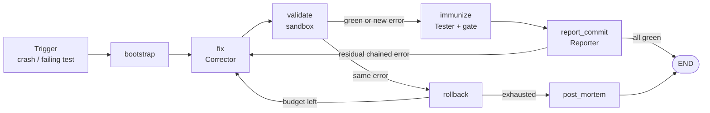

# Self-Healing System

> A **fix-first, multi-agent code self-healing pipeline**: when a deployment crashes or a
> CI test fails, three LLM agents repair the code inside a Docker sandbox, immunize the fix
> with a targeted regression test, and open a GitHub Pull Request — **never merging**.
> Human review is the only merge gate.

This repository is the software produced for the Bachelor's Thesis *Disseny i implementació
d'un sistema d'autocuració de codi mitjançant orquestració d'agents d'intel·ligència
artificial* (Arnau Fàbregas Figueras, Computer Engineering, Tarragona, 2026), supervised by
Pedro Antonio García López.

The pipeline follows the **Crash Driven Development (CDD)** principle, is orchestrated with
LangGraph, and is **model-agnostic** — any [litellm](https://github.com/BerriAI/litellm)
provider works. In-memory mocks ship with it, so the whole graph runs offline in
milliseconds.

## Results

All evaluated runs used **gpt-5.3-codex** on Azure OpenAI, with identical configuration
across repetitions (3 retries per error, 300 s agent timeout, 60 s sandbox timeout).

| Evaluation | Executions | Resolved | Avg. cost / run | Avg. duration |
|---|---|---|---|---|
| Own benchmark — 20 crash scenarios × 3 runs | 60 | **59 (98.3 %)** | $0.3624 | 7.3 min |
| SWE-bench Lite — 8 real instances × 3 runs | 24 | **22 (91.7 %)** | $0.79 | 13.7 min |

That is ~$0.018 per synthetic defect repaired and ~$0.108 per real defect repaired and
verified. Across all 84 executions only 3 ended unresolved, and they concentrate in three
specific cases — in both tracks the unstable cases are also the most expensive ones, so cost
works as an early indicator of fragility.

A resolution only counts when the fix is also **immunized** by a regression test; otherwise
it is scored as a failure.

**Verified externally.** SWE-bench verdicts come from the benchmark's official harness, which
re-runs the `FAIL_TO_PASS` and `PASS_TO_PASS` lists on every patch in a clean environment —
not from this system's own validation.

<details>
<summary>Breakdown</summary>

**Own benchmark.** Twenty scenarios over a banking-calculator application, one Python
exception each, following the language's built-in exception hierarchy. Nineteen of the
twenty resolve in all three runs, always on the first attempt and without a single rollback.

| Family | Scenarios | Success | Avg. cost | Avg. duration |
|---|---|---|---|---|
| Load errors (`SyntaxError`, `IndentationError`, `TabError`, `ImportError`, `ModuleNotFoundError`) | 5 | 15/15 | $0.0176 | 20.8 s |
| Runtime errors (`TypeError`, `ValueError`, `AttributeError`, `KeyError`, …) | 14 | 42/42 | $0.0143 | 17.8 s |
| `UnicodeDecodeError` (the one unstable scenario) | 1 | 2/3 | $0.0751 | 85.3 s |

Load errors run ~23 % more expensive than runtime ones: an import failure barely points at a
line, whereas a runtime exception drags the whole call stack to the origin — and the richness
of the traceback directly conditions the signal the Corrector receives.

**SWE-bench Lite.** Eight instances across `pylint`, `seaborn` and `flask`. Every candidate
first passed an environment check with no model calls (`FAIL_TO_PASS` must fail at the base
commit and pass with the reference patch), so any later failure is attributable to the system
and not to the environment. Six of the eight instances resolve in all three runs and the other
two in two of three, so all eight resolve at least once.

Two runs are worth singling out:

- **`flask-4045` — chained errors.** Five complete, consecutive healing cycles in a single
  session without one rollback. Fixing the original defect uncovered a different one; the
  system committed the progress, reset the in-flight error fields while keeping the history,
  and re-entered the Corrector with the new fingerprint — four more times. Six of the
  twenty-four executions healed at least one chained error.
- **`seaborn-2848` — the no-regression gate earning its keep.** On the third run a patch made
  the target test pass (satisfying `FAIL_TO_PASS`) but broke tests that already passed. The
  gate rejected it instead of consolidating it. The instance counts as unresolved and nothing
  is delivered — no prediction written, no PR opened — but the two chained errors already
  healed stay committed on the branch and the post-mortem documents them.

**Cost per agent** (SWE-bench, three runs combined: $2.375 over 359 model calls):

| Agent | Calls | Cost | Share |
|---|---|---|---|
| Corrector | 319 | $2.304 | 97 % |
| Reporter | 40 | $0.071 | 3 % |
| Tester | 0 | — | — |

The Tester does not appear because on test-entry immunization is a no-op: the failing CI test
already *is* the regression test.

**Unattended CI/CD deployment.** The workflow was installed on a watched repository, a defect
was pushed, and nothing else was touched:

| Phase | With defect | Clean |
|---|---|---|
| Checkout and Python setup | 2 s | 2 s |
| Dependency install | 55 s | 56 s |
| Sandbox image build | 11 s | 9 s |
| Probe, heal and Pull Request | 42 s | 3 s |
| **Total** | **1 min 50 s** | **1 min 10 s** |

The system built the trigger on its own, healed, validated in the sandbox, and opened the PR
in 42 s. A developer merged it; the merge push re-triggered the workflow, which probed the
tree, found it clean and finished green in 2 seconds **without a single model call** —
confirming both that nothing is spent on incidents that do not manifest and that the merged
fix was genuinely valid.

</details>

---

## 1. How it heals



- **Fix-first**: the Corrector edits the working tree immediately; no test is written
  before the fix. This bounds the LLM's non-determinism — a TDD-style approach would make
  the model author the specification it is then measured against.
- **Chained errors**: every failure is fingerprinted (`ErrorSignature` =
  kind + exception type + location). If fixing error A surfaces a *different* error B,
  A is committed and the loop re-enters for B — each healed error gets its own commit.
  Without a stable signal to tell "same error" from "different error" apart, every new
  failure would read as a failed attempt and the system would roll back real progress.
- **Immunization gate**: after a green fix (crash-entry only), the Tester writes a
  *targeted* regression test — it sees the failure, the fix diff and the real source,
  so it attacks the specific bug with the real API. The test is executed in the sandbox
  before being kept; if it fails, a deterministic smoke test takes its place.
  On test-entry the failing CI test *is* the regression test, so immunization is skipped.
- **No-regression gate**: a patch must satisfy both `FAIL_TO_PASS` and `PASS_TO_PASS`.
  Fixing the target error is not enough — breaking anything that already worked rejects it.
- **Budgets everywhere**: per-error retry budget, chained-error cycle budget, agent cost
  and step limits, sandbox timeouts.

## 2. The three agents

| Agent | Implementation | Role |
|---|---|---|
| **Corrector** (deliberative) | [mini-swe-agent](https://github.com/SWE-agent/mini-SWE-agent) 2.2+ (unmodified, driven by our own prompts/config) | Edits production code in a Docker container until the reproduction command exits 0. Never touches tests. |
| **Tester** (reactive) | `LLMTester` (single litellm call) | Writes one targeted regression test per healed crash; gated in the sandbox before committing. |
| **Reporter** (reactive) | `LLMReporter` (single litellm call, never blocks) | Conventional-Commits message per healed error; post-mortem narrative when the budget is exhausted. |

All three prompts follow the **PICCO** structure (Persona, Intention, Context,
Conditions, Output) — see `src/agents/`.

## 3. Architecture

Hexagonal (ports & adapters): the orchestrator depends only on `typing.Protocol` ports
and never imports a concrete adapter. Telemetry is layered on with GoF object
decorators, so business code contains zero instrumentation.

```
src/
├── core/                  # Pure application core (no I/O)
│   ├── domain/            # Models, HealingState, ErrorSignature, Span
│   └── ports/             # Protocols: Fixer/Tester/ReporterAgent, Sandbox, Git, GitHub, Telemetry
├── agents/                # LLM adapters (mini-swe-agent, litellm) + mocks
├── infrastructure/        # Docker sandbox, git ops, GitHub REST, filesystem reports
├── observability/         # Decorator instrumentation, spans, sinks, litellm cost callback
├── orchestrator/          # LangGraph StateGraph: nodes, routers, Dependencies
└── config/                # Env-driven settings + structured logging
scripts/
├── run_benchmark.py       # Benchmark harness (clones the bug-scenario repo)
├── run_swebench.py        # SWE-bench slice runner
├── swebench_select.py     # SWE-bench slice selector
└── heal_and_pr.py         # Real-environment entry point (heal → push → PR)
deploy/
└── selfheal-on-push.yml   # Workflow TEMPLATE for the monitored repository
```

Built on Python 3.11+ (asyncio), LangGraph, Pydantic v2, litellm, the Docker SDK and
GitPython, with Ruff and Mypy enforced over the whole source tree.

## 4. Quick start

```bash
pip install -r requirements.txt
docker build -t self-healing-sandbox:latest -f docker/sandbox.Dockerfile .

# Offline demo (mock agents, no LLM, milliseconds)
python -m src.main

# Test suite
python -m pytest tests/ -q
```

### Run the benchmark

```bash
export GITHUB_TOKEN=ghp_...                     # repo scope on the benchmark repo
export OPENAI_API_KEY=... OPENAI_API_BASE=...   # any litellm-supported provider works
export CDD_LLM_MODEL=openai/gpt-5.3-codex
export CDD_SWEAGENT_USE_DOCKER=1
python scripts/run_benchmark.py
```

Reports land in `reports/benchmarks/` (JSON + Markdown, with per-agent token/cost
telemetry); full agent trajectories in `reports/traces/`.

### Heal a real repository (PR-on-CI)

```bash
export CDD_SWEAGENT_DOCKER_IMAGE=self-healing-sandbox:latest  # pytest inside the Corrector's container

# auto: probe failing tests first, then a crashing main.py; exit 0 when green
python scripts/heal_and_pr.py --repo owner/name --base main --auto

# explicit modes
python scripts/heal_and_pr.py --repo owner/name --base main                  # crash-entry
python scripts/heal_and_pr.py --repo owner/name --base main --test tests/test_x.py::test_y
python scripts/heal_and_pr.py --repo owner/name --base main --auto --no-pr  # heal locally, no PR
```

### Close the loop with GitHub Actions

- **On push (the full loop)**: copy [`deploy/selfheal-on-push.yml`](deploy/selfheal-on-push.yml)
  into the *monitored* repo's `.github/workflows/`. Every push probes the repo and, on a
  failing test or crash, the multi-agent system opens a fix PR. Anti-loop guards included.
- **On demand**: [`.github/workflows/self-heal.yml`](.github/workflows/self-heal.yml)
  (`workflow_dispatch`) heals any repo by name.

Beyond the provider credentials, a read token on this repository and permission for Actions
to open Pull Requests, no further intervention is needed.

## 5. Configuration

All settings are environment variables (see `src/config/settings.py`):
`CDD_LLM_MODEL`, `CDD_AGENT_MODE`, `CDD_MAX_RETRIES`, `CDD_ERROR_CYCLE_BUDGET`,
`CDD_SANDBOX_IMAGE`, `CDD_SANDBOX_PYTHON`, `CDD_SANDBOX_TIMEOUT`, `CDD_SANDBOX_ALLOW_NETWORK`,
`CDD_SANDBOX_WORKDIR` (container mount point; `/workspace` by default, `/testbed` for SWE-bench),
`CDD_SWEAGENT_COST_LIMIT`, `CDD_SWEAGENT_STEP_LIMIT`, `CDD_SWEAGENT_TIMEOUT`,
`CDD_SWEAGENT_USE_DOCKER`, `CDD_SWEAGENT_DOCKER_IMAGE`, `CDD_SWEAGENT_TRAJECTORY_DIR`,
`CDD_TESTER_TIMEOUT`, `CDD_REPORTS_DIR`, `CDD_LOG_LEVEL`, `CDD_LOG_JSON` — plus the provider
credentials (`OPENAI_API_KEY`/`OPENAI_API_BASE`, `ANTHROPIC_API_KEY`, `OLLAMA_API_BASE`, …)
and `GITHUB_TOKEN` for clone/push/PR.

Provider independence was verified by running the pipeline against local models through
Ollama as well as against Azure OpenAI.

## 6. Observability

Every port and every graph node is wrapped by an `Instrumented*` decorator emitting
`Span`s; a litellm callback attributes **tokens and cost per agent** (contextvars tag
each completion as corrector/tester/reporter, including mini-swe-agent's internal
calls). Benchmark reports include the full aggregate; PR bodies include the heal's
total and per-agent cost, the reproduction command that triggered it, the resolved error
with its fingerprint, and an explicit notice that human review is mandatory.

Known profile: the Corrector dominates spend through *prompt* tokens — it resends its
growing trajectory every step.

## 7. Safety

- All code execution (reproduction, fixing, test gating) happens inside Docker.
- The system **never merges** — it opens PRs; a human reviews.
- The GitHub token is never logged; push errors are scrubbed before raising.
- Workflow inputs flow through `env` (no shell injection); `selfheal/**` pushes are
  ignored to prevent heal-the-heal loops.

## 8. SWE-bench (Corrector scaling test)

The system also runs against a slice of [SWE-bench](https://www.swebench.com/) — pure
test-entry, so it exercises the Corrector at real-repo scale (not the Tester). Select a
cheap slice, sanity-check the env without an LLM, heal, and score with the official harness:

```bash
python scripts/swebench_select.py --limit 8 --out slice.json
python scripts/run_swebench.py --instances-file slice.json --sanity      # no LLM
python scripts/run_swebench.py --instances-file slice.json --predictions-out preds.jsonl
```

Requires Linux or WSL2 — the official harness cannot run on Windows, and each instance pulls
a multi-gigabyte official image.

## 9. Limitations

- Resolution rate is not attributable to the orchestration alone: the ability to repair a
  given defect rests largely with the language model, and its limits — context window,
  tendency to hallucinate — pass straight through to the result.
- The SWE-bench evaluation covers 8 of the 300 Lite instances; the full set was out of reach
  on time and cost.
- `python -m pytest` assumes pytest-based repositories; other runners need adjustment.
